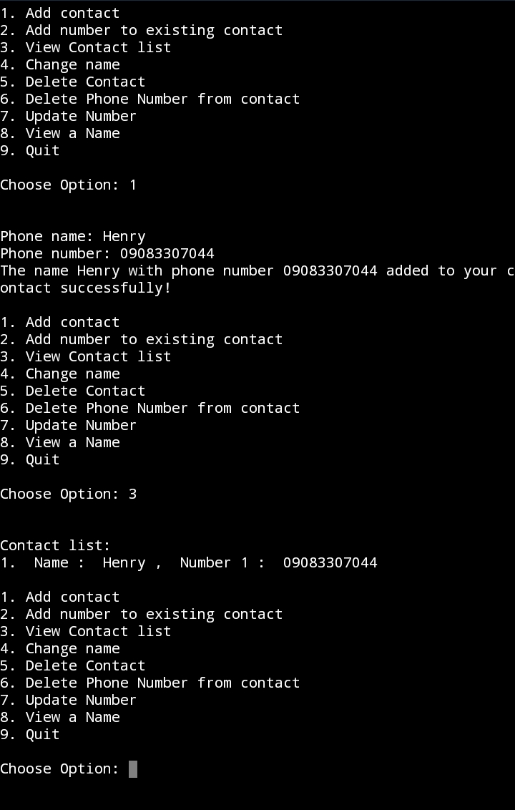

# 📱 Simple Phone Book – Python Beginner Project

A console-based contact manager built in Python. Perfect for learning dictionaries, functions, user input, and basic program flow.

## ✨ Features
- Add a new contact (name + phone)
- View all contacts (sorted alphabetically)
- Search for a contact by name
- Delete a contact
- Simple menu interface

## 🚀 Quick Start

1. Clone the repo (or just download the ZIP if you prefer):
bash
git clone https://github.com/Emusan-01/Python-phone-book-for-beginners.git
cd Python-phone-book-for-beginners
3. Ensure both files contact_01.py and contact.py are saved in the same directory

# Run it!
python contact.py

## 🛠️ What I Learned Building This
- Using **dictionaries** to store contact data (name → phone)
- Creating **functions** for each operation (add, view, search, delete)
- Handling user input with loops and validation
- Building a simple menu-driven console app
- Sorting output alphabetically for better UX

**Note:** Contacts are stored in memory only (they reset when you close the program). Future version will save to a JSON file!

## 📸 Demo

